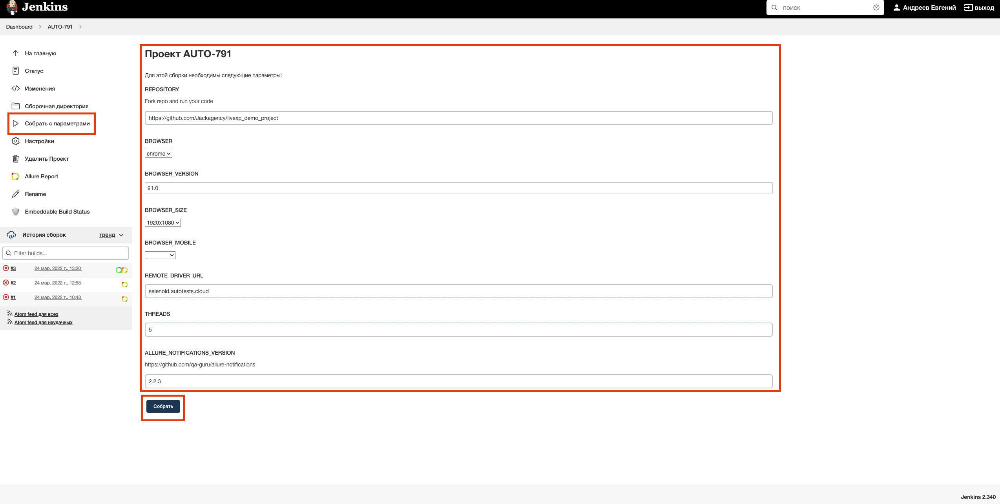

# Проект по автоматизации тестирования сайта LiveXP

## :page_with_curl:	Содержание

> :heavy_check_mark: [Технологии и инструменты](#technologist-технологии-и-инструменты)
>
> :heavy_check_mark: [Реализованы проверки](#bookmark_tabs-реализованы-проверки)
>
> :heavy_check_mark: [Запуск тестов из терминала](#computer-Запуск-тестов-из-терминала)
>
> :heavy_check_mark: [Запуск тестов в Jenkins](#-запуск-тестов-в-jenkins)
>
> :heavy_check_mark: [Отчет о результатах тестирования в Allure Report](#-отчет-о-результатах-тестирования-в-allure-report)
> 
> :heavy_check_mark: [Интеграция с Allure TestOps](#-интеграция-с-allure-testops)
>
> :heavy_check_mark: [Уведомления в Telegram с использованием бота](#-уведомления-в-telegram-с-использованием-бота)
>
> :heavy_check_mark: [Пример запуска теста в Selenoid](#-пример-запуска-теста-в-selenoid)

## :technologist: Технологии и инструменты

<p  align="center"

<code></code>
<code></code>
<code></code>
<code></code>
<code></code>
<code></code>
<code></code>
<code></code>
<code></code>
<code></code>
<code></code>
</p>

> *В данном проекте автотесты написаны на <code><strong>*Java*</strong></code> с использованием фреймворка <code><strong>*Selenide*</strong></code> для UI-тестов.*
>
>*Для сборки проекта используется <code><strong>*Gradle*</strong></code>.*
>
>*<code><strong>*JUnit 5*</strong></code> используется как фреймворк для модульного тестирования.*
>
>*Запуск тестов выполняется из <code><strong>*Jenkins*</strong></code>.*
>
>*<code><strong>*Selenoid*</strong></code> используется для запуска браузеров в контейнерах  <code><strong>*Docker*</strong></code>.*
>
>*<code><strong>*Allure Report, Allure TestOps, Telegram Bot*</strong></code> используются для визуализации результатов тестирования.*


## :bookmark_tabs: Реализованы проверки

### &nbsp;&nbsp;&nbsp;&nbsp;&nbsp;&nbsp; UI

> - [x] *Проверка перехода на страницу авторизации продукта 'Курьер'*
>- [x] *Проверка ошибок в консоле*
>- [x] *Проверка раздела 'О компании'*
>- [x] *Проверка перехода на страницу клиента из раздела 'Клиенты'*
>- [x] *Проверка банера главной страницы*
>- [x] *Проверка раздела 'Клиенты'*
>- [x] *Проверка работы поиска*
>- [x] *Проверка оформления подписки по почте*
>- [x] *Проверка заголовка главной страницы*

## :computer: Запуск тестов из терминала 

### Локальный запуск тестов

```bash
gradle clean test
```

### Удаленный запуск тестов

```bash
gradle clean test 
-Dbrowser=${BROWSER}
-DbrowserVersion=${BROWSER_VERSION}
-DbrowserSize=${BROWSER_SIZE}
-DbrowserMobileView="${BROWSER_MOBILE}"
-DremoteDriverUrl=https://user1:1234@${REMOTE_DRIVER_URL}/wd/hub/
-DvideoStorage=https://${REMOTE_DRIVER_URL}/video/
-Dthreads=${THREADS}
```

### Параметры сборки

> <code>REMOTE_URL</code> – адрес удаленного сервера, на котором будут запускаться тесты.
>
> <code>BROWSER</code> – браузер, в котором будут выполняться тесты (_по умолчанию - <code>chrome</code>_).
>
> <code>BROWSER_VERSION</code> – версия браузера, в которой будут выполняться тесты (_по умолчанию - <code>91.0</code>_).
>
> <code>BROWSER_SIZE</code> – размер окна браузера, в котором будут выполняться тесты (_по умолчанию - <code>1920x1080</code>_).

##  Запуск тестов в [Jenkins](https://jenkins.autotests.cloud/job/AUTO-791/)

*Для запуска сборки необходимо указать значения параметров и нажать кнопку <code><strong>*Собрать*</strong></code>.*

<p align="center">
  
</p>

##  Отчет о результатах тестирования в [Allure Report](https://jenkins.autotests.cloud/job/AUTO-791/3/allure/)

<p align="center">

</p>

### :pushpin: Grouping tests by tested functionality

<p align="center">

</p>

##  Интеграция с [Allure TestOps](https://allure.autotests.cloud/launch/11546)

### :pushpin: Основной дашборд

<p align="center">
  
</p>

### :pushpin: Тест-кейсы

<p align="center">
  
</p>

##  Уведомления в Telegram с использованием бота

> После завершения сборки специальный бот, созданный в <code>Telegram</code>, автоматически обрабатывает и отправляет сообщение с отчетом о прогоне тестов.

<p align="center">

</p>

##  Пример запуска теста в Selenoid

> К каждому тесту в отчете прилагается видео.
<p align="center">
  
</p>
